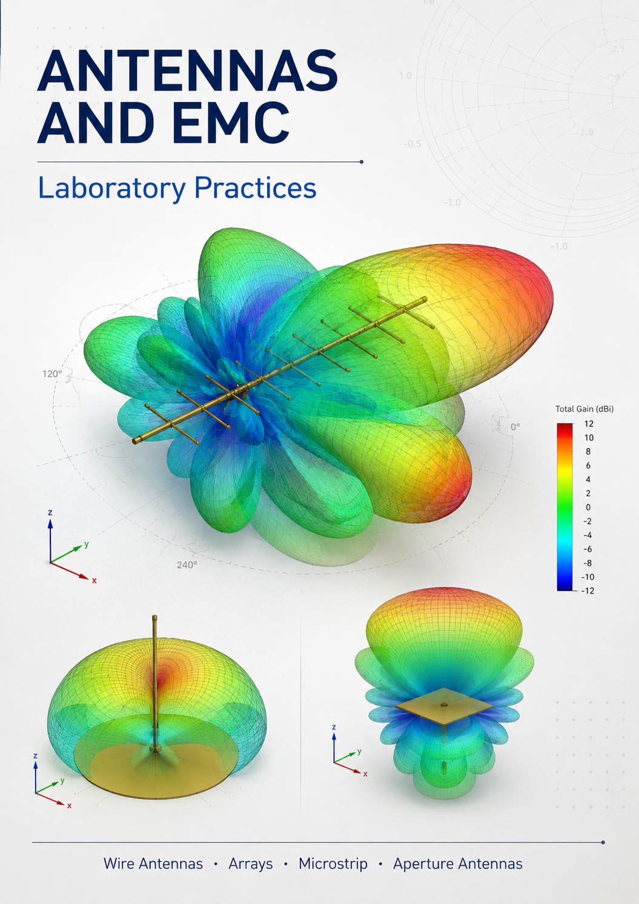

# Antennas & EMC — Laboratory Practices

Four full-wave simulation practices (FEKO, complemented with analytical models and MATLAB) covering the antenna design chain in a natural progression: from basic wire radiators to high-directivity apertures.

1. **Practice 1 — Wire Antenna Analysis**: Method of Moments in FEKO, mesh convergence study (λ/4 → λ/50), impedance, current distribution, near/far field and bandwidth of dipoles at 23 MHz.
2. **Practice 2 — Wire Antennas**: multi-element structures — arrays and Yagi-Uda antennas.
3. **Practice 3 — Microstrip Antennas**: printed patch antenna design and analysis.
4. **Practice 4 — Aperture Antennas**: horns and parabolic reflectors.

`Explanation_Antennas_and_EMC_Practices.txt` summarizes the purpose, procedure, main results and key lessons of each practice.
