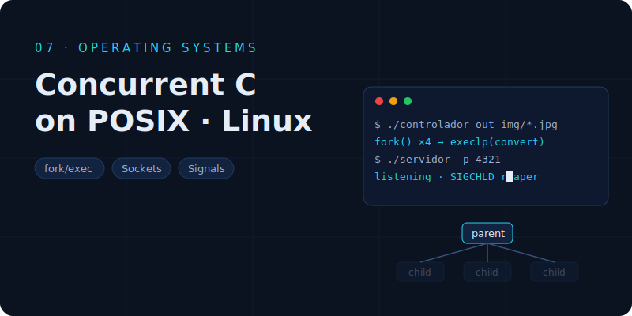

# Operating Systems — Concurrent Programming in C (POSIX)

Systems-programming practice built around process management, signals and sockets on Linux.

- **`controlador.c`** — concurrent image-processing controller: one child process per image (`fork` + `execlp` → ImageMagick blur), a maximum of 4 simultaneous workers managed with `waitpid`, and clean group shutdown on `SIGTERM`.
- **`servidor.c`** — concurrent TCP server (POSIX sockets): one child per client, "next prime number" service, zombie reaping with `SIGCHLD` + `WNOHANG`, configurable port (`-p`, default 1234).

Usage examples and design notes in `P1/document_explanations_en.txt`.
