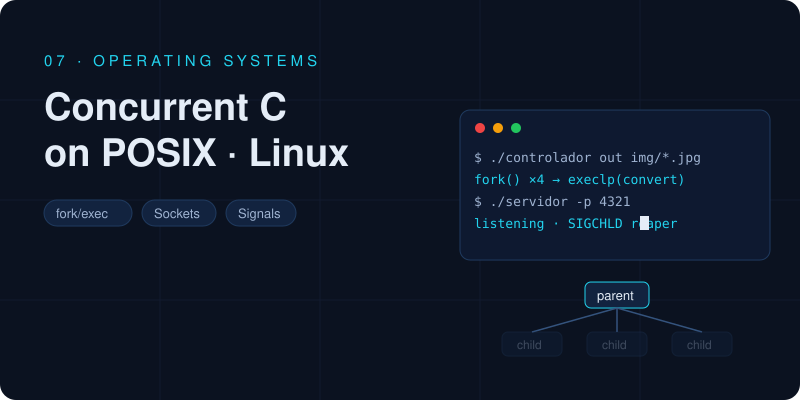

# Operating Systems — Concurrency and Containers

Two practices: concurrency first, with processes and threads, then lightweight
virtualisation with containers.

## P2 — Concurrent applications: processes and threads

### [`multiproceso-posix/`](P2-Procesos-e-Hilos/multiproceso-posix/) — C on POSIX

- **`controlador.c`** — concurrent image-processing controller: one child process per image (`fork` + `execlp` → ImageMagick blur), a maximum of 4 simultaneous workers managed with `waitpid`, and clean group shutdown on `SIGTERM`.
- **`servidor.c`** — concurrent TCP server (POSIX sockets): one child per client, "next prime number" service, zombie reaping with `SIGCHLD` + `WNOHANG`, configurable port (`-p`, default 1234).

Usage examples and design notes in [`document_explanations_en.txt`](P2-Procesos-e-Hilos/multiproceso-posix/document_explanations_en.txt).

### [`multihilo-java/`](P2-Procesos-e-Hilos/multihilo-java/) — threads in Java

A producer–consumer telemetry server: each ground-station request is split into
independent analysis jobs, dispatched through a shared `LinkedBlockingQueue` to
a pool of analyser threads sized from the available processors, and consolidated
into a single report. Synchronisation per request with `wait()` / `notify()`.

Architecture and build instructions in [`multihilo-java/README.md`](P2-Procesos-e-Hilos/multihilo-java/README.md).

## [P3 — Lightweight virtualisation with Docker and Kubernetes](P3-Virtualizacion-Docker-K8s/)

From a bare `docker run` to a WordPress stack deployed declaratively on a
Kubernetes cluster: namespaces and cgroups, volumes and published ports,
Compose, then minikube with pods, services, persistent volume claims and
kustomize.

The full report is in [`Practice_3_Virtualization_Docker_Kubernetes_Guillermo_Aladro_Abad.pdf`](P3-Virtualizacion-Docker-K8s/Practice_3_Virtualization_Docker_Kubernetes_Guillermo_Aladro_Abad.pdf); manifests, runbooks and the technical discussion in
[`P3-Virtualizacion-Docker-K8s/README.md`](P3-Virtualizacion-Docker-K8s/README.md).
