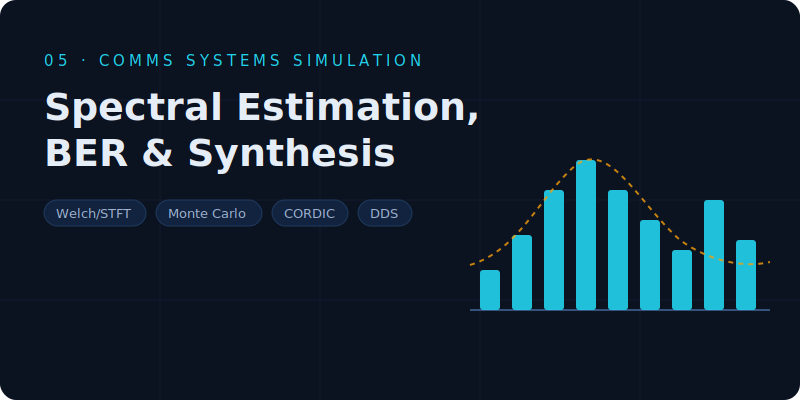
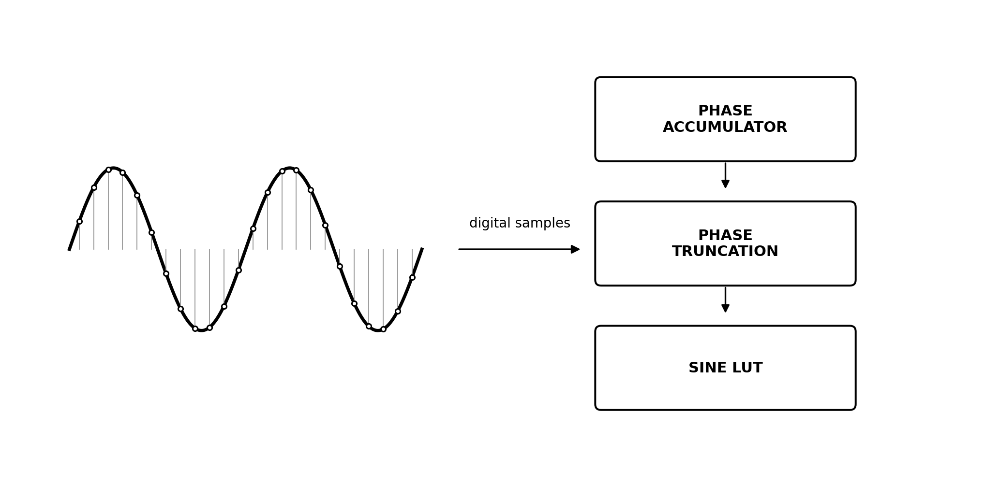

# PSC — Communication Systems Simulation (MATLAB)

Six MATLAB practices on statistical signal processing and digital synthesis for communications. Each folder contains code, result figures and an English technical report (PDF).

<table>
  <tr>
    <td width="33%" align="center"> <b>P1</b> &#183; Spectral Estimation</td>
    <td width="33%" align="center"> <b>P3</b> &#183; Noise Generation</td>
    <td width="33%" align="center"> <b>P6</b> &#183; DDS</td>
  </tr>
</table>

- **P1 — Spectral Estimation**: periodogram, Welch and STFT analysis (including 3-D views), with reference validation data.
- **P2 — BER Performance**: conventional Monte Carlo (N = 10⁷ bits per SNR point) vs importance sampling, with a memory-safe block implementation.
- **P3 — Noise Generation**: white Gaussian and coloured noise via FIR, IIR and mask-based spectral shaping, with correlation checks.
- **P4 — Gaussian White & Coloured Noise**: consolidated report with reproduction scripts and full figure set.
- **P5 — CORDIC**: 32-step rotation-mode CORDIC generator; verification with fixed tones and an LFM chirp.
- **P6 — DDS**: direct digital synthesis with a Q31 look-up table — tone and LFM generation, spectra and spectrograms.
