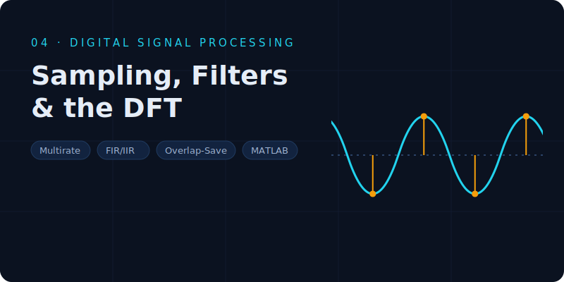

  

  
  
  
  
  

  Final-year <b>Telecommunications Systems Engineering</b> student at <b>ETSIST-UPM (Madrid)</b>, 
  specializing in radiocommunications, antennas and satellite systems. 
  Seven project areas — each folder has its own introduction, reports, code and results. Click a card to explore.

<table>
  <tr>
    <td width="50%" align="center"></td>
    <td width="50%" align="center"></td>
  </tr>
  <tr>
    <td width="50%" align="center"></td>
    <td width="50%" align="center"></td>
  </tr>
  <tr>
    <td width="50%" align="center"></td>
    <td width="50%" align="center"></td>
  </tr>
  <tr>
    <td colspan="2" align="center"></td>
  </tr>
</table>

  FEKO &#183; MATLAB / Simulink &#183; Xirio &#183; ADALM-PLUTO SDR &#183; Microstrip fabrication &amp; VNA measurement &#183; Python / Qiskit &#183; C (POSIX) &#183; Git

