# Radiocommunications — Planning & SDR Practices

Four end-to-end radio engineering exercises combining link-budget theory, professional planning tools (Xirio), commercial equipment selection, ITU-R criteria and hands-on SDR measurement.

<table>
  <tr>
    <td width="33%" align="center"> <b>P1</b> &#183; Radio Link Planning</td>
    <td width="33%" align="center"> <b>P2</b> &#183; DVB-T Repeater</td>
    <td width="33%" align="center"> <b>P3</b> &#183; SDR &amp; SINAD</td>
  </tr>
</table>

Click a cover to open its full report (P4 &#183; 4G-LTE report below).

1. **Radio Link Planning** — three-hop 26 GHz digital link Ávila → Escalona, validated with theoretical link budgets, Xirio simulation and ITU-R availability criteria.
2. **DVB-T Repeater Planning** — gap filler for Redueña: channel, site, antenna and transmitter selection, with coverage and reception-margin verification.
3. **Software-Defined Radio & SINAD** — FM receiver on an ADALM-PLUTO SDR (MATLAB/Simulink) with audio quality evaluated via SINAD.
4. **4G-LTE Coverage** — three-site, nine-sector LTE network around Ávila: coverage, best-server and overlap analysis for reliable service and handover.

Full objectives in `Practice_Objectives_EN.txt`; each practice has its own English report (PDF).
