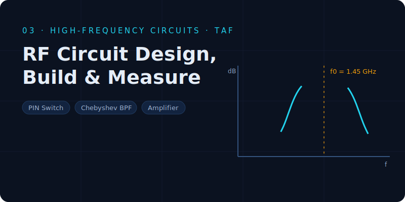

# TAF — High-Frequency Circuit Design

Three RF circuits taken through the complete cycle: design → simulation → microstrip fabrication → S-parameter measurement → physical retuning of the prototype.

1. **PIN-Diode RF Switch** (1.45 GHz) — shunt-diode microstrip switch; forward- vs reverse-bias S-parameters compared.
2. **Coupled-Line Band-Pass Filter** (1.45 GHz) — third-order, 1 dB-ripple Chebyshev design; electrical coupling requirements converted into microstrip dimensions; simulation vs measurement.
3. **Small-Signal Amplifier** (1.05 GHz, BFR93A) — biasing, stabilization, input/output matching, layout and hardware retuning.

Full objectives in `Practice_Objectives_Guillermo_Aladro_Abad.txt`; each practice has its own report (PDF).
